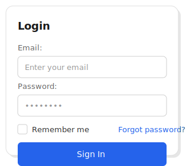

# Wireframe

> Create UI wireframes with simple, readable text syntax

<table>
<tr>
<td width="50%">

```wireframe
wireframe sketch
    Card w=300
        Vertical gap=16 padding=24
            Label "**Login**"
            
            Label "Email:"
            TextInput "Enter your email" :txtEmail
            
            Label "Password:"
            PasswordInput "••••••••" :txtPass
            
            Horizontal justify=between
                Checkbox "Remember me"
                Label "Forgot password?" @Forgot
            /Horizontal
            
            Button "Sign In" primary
        /Vertical
    /Card
/wireframe
```

</td>
<td width="50%">



</td>
</tr>
</table>

## ✨ Features

| | Feature | Description |
|---|---------|-------------|
| 📝 | **Simple Syntax** | Keyword-based, easy to learn and remember |
| 🎨 | **4 Themes** | Sketch, Blueprint, Clean, Realistic |
| 🧩 | **40+ Controls** | Buttons, inputs, tables, navigation, and more |
| 📐 | **6 Layouts** | Vertical, Horizontal, Grid, Dock, Canvas, Scroll |
| ⚡ | **Live Preview** | See changes instantly in VS Code |
| 🔌 | **Mermaid Plugin** | Use in any Mermaid-enabled environment |
| ♿ | **Accessible** | WCAG-compliant SVG output |
| 🚀 | **Fast** | LRU caching, optimized rendering |

---

## 🚀 VS Code Extension (Recommended)

The easiest way to use Wireframe is with the VS Code extension.

### Install

[](vscode:extension/jonkeda.wireframe-vscode)

Or search for **"Wireframe"** in VS Code Extensions (`Ctrl+Shift+X`).

### Create Your First Wireframe

1. Create a new file: `example.wire`
2. Type your wireframe:
   ```wireframe
   wireframe clean
       Button "Hello World" primary
   /wireframe
   ```
3. Press `Ctrl+Shift+V` to open preview

### Extension Features

✅ Syntax highlighting  
✅ Live preview (side-by-side)  
✅ IntelliSense autocomplete  
✅ Error diagnostics  
✅ Export to SVG/PNG  
✅ Theme switching  

---

## 📦 npm Packages

For programmatic use, CI/CD integration, or custom tooling.

### Install

```bash
npm install @jonkeda/wireframe-core
```

### Usage

```typescript
import { compile } from '@jonkeda/wireframe-core';

const { svg, errors } = compile(`
wireframe clean
    Button "Click Me" primary
/wireframe
`);

// svg contains the rendered SVG string
```

### All Packages

| Package | Description |
|---------|-------------|
| [`@jonkeda/wireframe-core`](https://www.npmjs.com/package/@jonkeda/wireframe-core) | Parser and renderer |
| [`@jonkeda/wireframe-themes`](https://www.npmjs.com/package/@jonkeda/wireframe-themes) | Additional themes |
| [`@jonkeda/wireframe-mermaid`](https://www.npmjs.com/package/@jonkeda/wireframe-mermaid) | Mermaid.js plugin |
| [`@jonkeda/wireframe-cli`](https://www.npmjs.com/package/@jonkeda/wireframe-cli) | Command-line tool |

### CLI

```bash
npm install -g @jonkeda/wireframe-cli

# Render to SVG
wire render input.wire -o output.svg

# Validate syntax
wire validate input.wire

# Watch mode
wire render input.wire --watch
```

---

## 📖 Syntax Overview

### Document Structure

```wireframe
wireframe [theme]       // Start (sketch|blueprint|clean|realistic)
    %title: Page Title  // Metadata
    
    // Content here
    
/wireframe              // End
```

### Controls

| Category | Controls |
|----------|----------|
| **Basic** | `Button`, `Label`, `TextInput`, `TextArea`, `Checkbox`, `Radio`, `Dropdown`, `Switch` |
| **Layout** | `Vertical`, `Horizontal`, `Grid`, `Dock`, `Canvas`, `Scroll` |
| **Sections** | `Card`, `Panel`, `Header`, `Footer`, `Sidebar`, `Window`, `Modal` |
| **Navigation** | `Menu`, `MenuItem`, `Tabs`, `Tab`, `Breadcrumb`, `Pagination` |
| **Data** | `Table`, `DataGrid`, `List`, `Tree` |
| **Feedback** | `Alert`, `Toast`, `Dialog`, `Progress`, `Badge` |

### Attributes

```wireframe
Button "Label" primary              // Style modifier
TextInput "Name" :txtName required  // ID and validation
Vertical gap=16 padding=24          // Layout properties
Icon $settings                      // Icon reference
```

---

## 📚 Documentation

- [Getting Started](wireframe/docs/GETTING_STARTED.md) - Installation and first steps
- [API Reference](wireframe/docs/API_REFERENCE.md) - Complete API documentation
- [Examples](wireframe/docs/EXAMPLES.md) - Example wireframes
- [Changelog](wireframe/CHANGELOG.md) - Version history

### Architecture

- [Language Specification](architecture/Wireframe/planning/06k_Language_Specification_v7_Keywords.md)
- [Component Library](architecture/Wireframe/docs/25_Component_Library.md)
- [Architecture Overview](architecture/Wireframe/docs/20_Architecture_Overview.md)

---

## 🤝 Contributing

Contributions are welcome! Please read our contributing guidelines before submitting PRs.

## 📄 License

MIT © jonkeda
